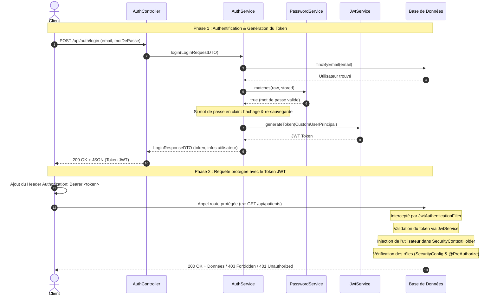

# Documentation de l'Authentification et des Autorisations (JWT + Spring Security)

Ce document décrit l'implémentation de la sécurité (authentification et gestion des permissions d'accès) au sein de l'API **Tooth Office**.

---

## 1. Architecture Générale

L'application utilise une architecture de sécurité moderne basée sur **Spring Security** et les **JSON Web Tokens (JWT)**. L'authentification est entièrement **stateless** (sans état) : le serveur ne maintient aucune session HTTP en mémoire. Chaque requête doit être accompagnée d'un token JWT valide pour être acceptée (sauf pour les routes publiques).

### Technologies clés
*   **Spring Security (v6.x / Spring Boot 3.x)** : Framework de sécurisation de l'application.
*   **JJWT (Java JWT - io.jsonwebtoken v0.13.0)** : Bibliothèque Java utilisée pour générer, parser et valider les tokens JWT.
*   **BCrypt** : Algorithme de hachage fort utilisé pour sécuriser les mots de passe des utilisateurs en base de données.

---

## 2. Processus d'Authentification de A à Z (Flux de Requête)

Voici le cycle de vie complet, étape par étape, depuis la soumission des identifiants jusqu'à l'accès à une ressource protégée.



### Étape 1 : Demande de connexion (`POST /api/auth/login`)
1. Le client envoie une requête HTTP `POST` sur l'endpoint public `/api/auth/login` avec ses identifiants dans un objet JSON (`LoginRequestDTO`).
2. La requête arrive dans [AuthController](src/main/java/org/odk/tooth_office/auth/AuthController.java) qui délègue la vérification à [AuthServiceImplementation](src/main/java/org/odk/tooth_office/auth/AuthServiceImplementation.java).
3. Le service recherche l'utilisateur en base de données à l'aide de l'email via [UtilisateurRepository](src/main/java/org/odk/tooth_office/Repository/UtilisateurRepository.java).
    * Si l'utilisateur n'existe pas, une `BadCredentialsException` est levée (renvoyant une erreur d'authentification).
4. Le service vérifie ensuite le statut du compte (`statutCompte`) :
    * Si le compte n'est pas au statut `VALIDE` (par exemple, s'il est `SUSPENDU` ou `SUPPRIMER`), une exception est levée.
5. Le mot de passe en clair est comparé à celui stocké en base de données en faisant appel à [PasswordService](src/main/java/org/odk/tooth_office/security/PasswordService.java).
    * Si les mots de passe ne correspondent pas, une `BadCredentialsException` est levée.
    * *(Voir section 5 pour le mécanisme de migration douce des mots de passe en clair).*

### Étape 2 : Génération du JWT
1. Une fois les identifiants validés, l'application encapsule l'entité `Utilisateur` dans un objet [CustomUserPrincipal](src/main/java/org/odk/tooth_office/security/CustomUserPrincipal.java) (qui implémente `UserDetails`).
2. Le service appelle [JwtService](src/main/java/org/odk/tooth_office/security/JwtService.java) pour générer le token JWT.
3. Ce token contient des données (claims) utiles pour le client et le serveur :
    * **Subject (sub)** : L'adresse email de l'utilisateur.
    * **role** : Le rôle de l'utilisateur (`ADMIN_SYSTEM`, `CHEF_CABINET`, etc.).
    * **userId** : L'identifiant unique de l'utilisateur.
    * **fullName** : Le prénom et le nom de l'utilisateur.
    * **Expiration** : Date de fin de validité (configurée à 24h par défaut).
    * **Signature** : Signé cryptographiquement avec une clé HMAC-SHA basée sur le secret défini dans `application.properties`.
4. Le serveur retourne un objet `LoginResponseDTO` contenant le token JWT, le type de schéma d'authentification (`Bearer`), ainsi que les informations de base de l'utilisateur (identifiant, email, nom complet et rôle).

### Étape 3 : Utilisation du token par le client
Pour chaque requête ultérieure nécessitant une authentification, le client doit inclure le token JWT dans l'en-tête HTTP `Authorization` comme suit :
```http
Authorization: Bearer <VOTRE_TOKEN_JWT>
```

### Étape 4 : Interception, extraction et validation à chaque requête
1. Toute requête HTTP entrante est interceptée par la chaîne de filtres Spring Security configurée dans [SecurityConfig](src/main/java/org/odk/tooth_office/security/SecurityConfig.java).
2. Le filtre personnalisé [JwtAuthenticationFilter](src/main/java/org/odk/tooth_office/security/JwtAuthenticationFilter.java) (qui étend `OncePerRequestFilter`) s'exécute.
3. Le filtre extrait le header `Authorization` :
    * S'il est absent ou ne commence pas par `Bearer `, la requête est immédiatement transmise au filtre suivant sans authentification.
    * S'il commence bien par `Bearer `, le filtre extrait la chaîne du token (les caractères situés après le préfixe).
4. Le filtre extrait l'email de l'utilisateur contenu dans le token à l'aide de [JwtService](src/main/java/org/odk/tooth_office/security/JwtService.java).
5. Si un email est trouvé et qu'aucune authentification n'existe déjà dans le contexte de sécurité (`SecurityContextHolder.getContext().getAuthentication() == null`) :
    * Les détails complets de l'utilisateur sont chargés depuis la base de données via [CustomUserDetailsService](src/main/java/org/odk/tooth_office/security/CustomUserDetailsService.java).
    * Le filtre vérifie la validité du token à l'aide de `jwtService.isTokenValid(token, userDetails)`.
    * Si le token est valide, le filtre crée un objet `UsernamePasswordAuthenticationToken` contenant le principal (`CustomUserPrincipal`), les identifiants (laissé à `null` par sécurité) et les droits accordés (rôles/autorités).
    * Cet objet d'authentification est injecté dans le contexte de sécurité :
      ```java
      SecurityContextHolder.getContext().setAuthentication(authToken);
      ```
6. En cas d'erreur lors du décodage ou si le token a expiré, une `JwtException` est interceptée, et le contexte de sécurité est explicitement vidé par mesure de précaution (`SecurityContextHolder.clearContext()`).
7. La requête poursuit ensuite sa progression vers les contrôleurs ou les filtres suivants.

### Étape 5 : Autorisation et gestion des accès
Une fois la requête authentifiée (l'utilisateur est identifié dans le `SecurityContextHolder`), Spring Security vérifie si l'utilisateur détient les rôles nécessaires pour la ressource demandée.
* Si l'utilisateur tente d'accéder à une ressource protégée sans être authentifié, l'erreur est capturée par [SecurityExceptionHandler](src/main/java/org/odk/tooth_office/security/SecurityExceptionHandler.java) (`AuthenticationEntryPoint`) qui renvoie une réponse JSON structurée avec un code `401 Unauthorized`.
* Si l'utilisateur authentifié tente d'accéder à une ressource pour laquelle il n'a pas les droits/rôles requis, l'erreur est capturée par [SecurityExceptionHandler](src/main/java/org/odk/tooth_office/security/SecurityExceptionHandler.java) (`AccessDeniedHandler`) qui renvoie une réponse JSON structurée avec un code `403 Forbidden`.

---

## 3. Structure des Classes et Rôles

Le système d'authentification repose sur les composants suivants répartis dans les packages `security` et `auth` :

| Nom de la classe / Fichier | Emplacement | Rôle Principal |
| :--- | :--- | :--- |
| [Utilisateur](src/main/java/org/odk/tooth_office/Entity/Utilisateur.java) | `Entity` | Entité JPA représentant la table mère `Utilisateur` en base de données. Elle contient l'email, le mot de passe (`mdp`), le rôle (`RoleEnum`) et le statut (`StatutCompte`). |
| [CustomUserPrincipal](src/main/java/org/odk/tooth_office/security/CustomUserPrincipal.java) | `security` | Implémentation de l'interface `UserDetails` de Spring Security. Fait le pont entre l'entité JPA `Utilisateur` et le framework de sécurité. Définit les méthodes d'accès (rôles préfixés par `ROLE_`, statut du compte, etc.). |
| [CustomUserDetailsService](src/main/java/org/odk/tooth_office/security/CustomUserDetailsService.java) | `security` | Implémentation de `UserDetailsService`. Utilisée par Spring Security pour charger l'utilisateur depuis la base de données via son adresse email. |
| [JwtService](src/main/java/org/odk/tooth_office/security/JwtService.java) | `security` | Service utilitaire pour les opérations liées au JWT : génération de token, extraction des claims (sujet, rôle, identifiant, etc.), et vérification de la date d'expiration. |
| [JwtAuthenticationFilter](src/main/java/org/odk/tooth_office/security/JwtAuthenticationFilter.java) | `security` | Intercepteur HTTP (`OncePerRequestFilter`) qui lit le token JWT dans l'en-tête `Authorization`, le valide, et charge l'authentification de l'utilisateur dans le contexte Spring Security pour la requête en cours. |
| [PasswordService](src/main/java/org/odk/tooth_office/security/PasswordService.java) | `security` | Service encapsulant la logique d'encodage et de comparaison de mots de passe. Il prend en charge à la fois BCrypt et les mots de passe hérités stockés en clair. |
| [SecurityConfig](src/main/java/org/odk/tooth_office/security/SecurityConfig.java) | `security` | Configuration centrale de la sécurité HTTP. Elle définit la politique de session (Stateless), désactive le CSRF, déclare le filtre JWT, configure les règles d'accès globales (URL matchers), et déclare les beans d'authentification (`AuthenticationManager`, `PasswordEncoder`). |
| [SecurityExceptionHandler](src/main/java/org/odk/tooth_office/security/SecurityExceptionHandler.java) | `security` | Centralise la gestion des exceptions de sécurité au niveau des filtres en renvoyant des réponses JSON standardisées et compréhensibles au format `RFC 7807` pour les erreurs `401` et `403`. |
| [AuthController](src/main/java/org/odk/tooth_office/auth/AuthController.java) | `auth` | Contrôleur REST exposant les endpoints publics de connexion (`/login`) et les endpoints sécurisés d'obtention du profil (`/me`) et de modification du mot de passe (`/change-password`). |

---

## 4. Gestion des Permissions d'Accès et des Rôles

Le système Tooth Office définit 5 rôles distincts au sein de l'énumération [RoleEnum](src/main/java/org/odk/tooth_office/Enum/RoleEnum.java) :
1.  **`ADMIN_SYSTEM`** : Administrateur global du système.
2.  **`CHEF_CABINET`** : Gestionnaire principal d'un ou plusieurs cabinets dentaires.
3.  **`DENTISTE`** : Praticien au sein d'un cabinet dentaire.
4.  **`SECRETAIRE`** : Assistant administratif en charge de l'accueil et de la gestion de cabinet.
5.  **`PATIENT`** : Bénéficiaire des soins.

Dans Spring Security, ces rôles sont convertis en autorités dotées du préfixe `ROLE_` (ex: `ROLE_ADMIN_SYSTEM`).

La vérification des droits s'effectue à deux niveaux : **URL-based** (filtres HTTP) et **Method-based** (annotations).

### A. Sécurité au Niveau des URL (`SecurityConfig.java`)
Dans la méthode `securityFilterChain`, les règles de filtrage globales sont déclarées dans l'ordre de priorité (du plus restrictif au moins restrictif) :

```java
.authorizeHttpRequests(auth -> auth
    // En-têtes et endpoints publics
    .requestMatchers(
            "/api/auth/**",
            "/swagger-ui/**",
            "/v3/api-docs/**",
            "/swagger-ui.html"
    ).permitAll()
    
    // Administration système
    .requestMatchers("/api/admins/**", "/api/utilisateurs/**").hasRole("ADMIN_SYSTEM")
    
    // Gestion des équipes et cabinets
    .requestMatchers("/api/chefs-cabinet/**").hasAnyRole("ADMIN_SYSTEM", "CHEF_CABINET")
    .requestMatchers("/api/dentistes/**", "/api/secretaires/**").hasAnyRole("ADMIN_SYSTEM", "CHEF_CABINET")
    
    // Gestion des fiches patients
    .requestMatchers("/api/patients/**").hasAnyRole("ADMIN_SYSTEM", "CHEF_CABINET", "SECRETAIRE", "DENTISTE")
    
    // Dossiers médicaux, consultations et traitements
    .requestMatchers(
            "/api/dossiers-medicaux/**",
            "/api/consultation/**",
            "/api/consultations/**",
            "/traitements/**"
    ).hasAnyRole("ADMIN_SYSTEM", "CHEF_CABINET", "DENTISTE")
    
    // Abonnements et plans tarifaires
    .requestMatchers("/api/abonnements/**", "/api/plans-abonnement/**").hasAnyRole("ADMIN_SYSTEM", "CHEF_CABINET")
    
    // Reste de l'application nécessitant une connexion simple
    .anyRequest().authenticated()
)
```

### B. Sécurité au Niveau des Méthodes (`@PreAuthorize`)
L'annotation `@EnableMethodSecurity` présente sur la classe de configuration permet d'activer la sécurisation fine au niveau des classes et des méthodes des contrôleurs REST à l'aide d'expressions Spring EL.

Voici la liste des contrôleurs utilisant des annotations de sécurité au niveau de la classe :

*   [AdminSystemController](src/main/java/org/odk/tooth_office/Controller/AdminSystemController.java) :
    `@PreAuthorize("hasRole('ADMIN_SYSTEM')")`
*   [UtilisateurController](src/main/java/org/odk/tooth_office/Controller/UtilisateurController.java) :
    `@PreAuthorize("hasRole('ADMIN_SYSTEM')")`
*   [ChefCabinetController](src/main/java/org/odk/tooth_office/Controller/ChefCabinetController.java) :
    `@PreAuthorize("hasAnyRole('ADMIN_SYSTEM','CHEF_CABINET')")`
*   [DentisteController](src/main/java/org/odk/tooth_office/Controller/DentisteController.java) :
    `@PreAuthorize("hasAnyRole('ADMIN_SYSTEM','CHEF_CABINET')")`
*   [SecretaireController](src/main/java/org/odk/tooth_office/Controller/SecretaireController.java) :
    `@PreAuthorize("hasAnyRole('ADMIN_SYSTEM','CHEF_CABINET')")`
*   [PatientController](src/main/java/org/odk/tooth_office/Controller/PatientController.java) :
    `@PreAuthorize("hasAnyRole('ADMIN_SYSTEM','CHEF_CABINET','SECRETAIRE','DENTISTE')")`
*   [DossierMedicalController](src/main/java/org/odk/tooth_office/Controller/DossierMedicalController.java) :
    `@PreAuthorize("hasAnyRole('ADMIN_SYSTEM','CHEF_CABINET','DENTISTE')")`

### C. Synthèse de la Matrice des Droits d'Accès

Le tableau ci-dessous synthétise les droits de lecture / écriture globaux par ressource et par rôle :

| Ressource / Endpoint | ADMIN_SYSTEM | CHEF_CABINET | DENTISTE | SECRETAIRE | PATIENT |
| :--- | :---: | :---: | :---: | :---: | :---: |
| **Authentification (`/api/auth/**`)** | Public | Public | Public | Public | Public |
| **Swagger (`/swagger-ui/**`)** | Public | Public | Public | Public | Public |
| **Admins (`/api/admins/**`)** | ✅ | ❌ | ❌ | ❌ | ❌ |
| **Utilisateurs (`/api/utilisateurs/**`)** | ✅ | ❌ | ❌ | ❌ | ❌ |
| **Chefs de Cabinet (`/api/chefs-cabinet/**`)** | ✅ | ✅ | ❌ | ❌ | ❌ |
| **Dentistes / Secrétaires (`/api/dentistes/**`, `/secretaires/**`)** | ✅ | ✅ | ❌ | ❌ | ❌ |
| **Patients (`/api/patients/**`)** | ✅ | ✅ | ✅ | ✅ | ❌ |
| **Dossiers Médicaux / Consultations / Traitements** | ✅ | ✅ | ✅ | ❌ | ❌ |
| **Abonnements (`/api/abonnements/**`, `/plans-abonnement/**`)** | ✅ | ✅ | ❌ | ❌ | ❌ |
| **Prestations (`/api/prestation/**`)** | ✅ | ✅ | ✅ | ✅ | ✅ |
| **Avis / Autres ressources par défaut** | ✅ | ✅ | ✅ | ✅ | ✅ |

> [!NOTE]
> Pour les ressources par défaut n'appartenant pas à une catégorie explicite dans `SecurityConfig`, la politique appliquée est `.anyRequest().authenticated()`, signifiant que tout utilisateur authentifié (quel que soit son rôle) a accès à l'endpoint sous réserve de validation métier éventuelle dans le service.

---

## 5. Mécanisme Spécial : Migration Douce des Mots de Passe

Lors de la phase initiale de développement, la base de données contenait des données de démonstration (`data.sql`) avec des mots de passe stockés en clair (ex: `pass123`). Pour éviter de bloquer l'accès ou de forcer une réinitialisation manuelle des données, un mécanisme de migration progressive et transparente a été intégré dans [PasswordService](src/main/java/org/odk/tooth_office/security/PasswordService.java) :

1.  **Vérification de la structure du mot de passe** :
    Lors de la comparaison via `matches(raw, stored)` :
    *   Si le mot de passe stocké commence par les préfixes standard de BCrypt (`$2a$`, `$2b$`, `$2y$`), l'application utilise l'encodeur de mot de passe standard `BCryptPasswordEncoder` pour effectuer la vérification sécurisée.
    *   Si ces préfixes ne sont pas détectés, l'application considère que le mot de passe stocké est encore en clair et effectue une comparaison directe de chaînes de caractères (`rawPassword.equals(storedPassword)`).
2.  **Mise à niveau automatique (Rehash on login)** :
    Dans [AuthServiceImplementation.java](src/main/java/org/odk/tooth_office/auth/AuthServiceImplementation.java), après une connexion réussie d'un compte avec un mot de passe en clair :
    *   Le système détecte le besoin de hachage à l'aide de `passwordService.needsRehash(utilisateur.getmdp())`.
    *   Le mot de passe en clair fourni par l'utilisateur lors de la connexion est haché à la volée avec BCrypt.
    *   Le mot de passe haché remplace le mot de passe en clair et est enregistré de manière persistante en base de données.
    *   Les connexions ultérieures de cet utilisateur s'effectueront via le hachage BCrypt standard.

---

## 6. Comment Tester l'Authentification (Postman ou curl)

### Étape 1 : Connexion (Obtention du Token JWT)
Envoyer une requête `POST` à l'adresse suivante :
*   **URL** : `http://localhost:8080/api/auth/login`
*   **Headers** : `Content-Type: application/json`
*   **Body (JSON)** :
```json
{
  "email": "admin@toothoffice.cd",
  "motDePasse": "pass123"
}
```

**Exemple de réponse (200 OK)** :
```json
{
  "token": "eyJhbGciOiJIUzI1NiIsInR5cCI6IkpXVCJ9.eyJyb2xlIjoiQURNSU5fU1lTVEVNIiwidXNlcklkIjoxMCwiZnVsbE5hbWUiOiJTeXN0ZW1lIEFkbWluIiwic3ViIjoiYWRtaW5AdG9vdGhvZmZpY2UuY2QiLCJpYXQiOjE2ODgwNjQwMDAsImV4cCI6MTY4ODE1MDQwMH0...",
  "type": "Bearer",
  "id": 10,
  "email": "admin@toothoffice.cd",
  "nomComplet": "Systeme Admin",
  "role": "ADMIN_SYSTEM"
}
```

### Étape 1 bis : Inscription (Création de compte + Connexion automatique)
Envoyer une requête `POST` à l'adresse suivante :
*   **URL** : `http://localhost:8080/api/auth/register`
*   **Headers** : `Content-Type: application/json`
*   **Body (JSON) pour un Patient** :
```json
{
  "nom": "Kowalski",
  "prenom": "Jan",
  "email": "jan.kowalski@example.com",
  "motDePasse": "superSecretPassword123",
  "confirmationMotDePasse": "superSecretPassword123",
  "telephone": "+48123456789",
  "adresse": "Varsovie, Pologne",
  "role": "PATIENT",
  "dateNaissance": "1990-05-15"
}
```
*   **Body (JSON) pour un Chef de Cabinet** :
```json
{
  "nom": "Dupont",
  "prenom": "Pierre",
  "email": "pierre.dupont@example.com",
  "motDePasse": "passwordChef123",
  "confirmationMotDePasse": "passwordChef123",
  "telephone": "+33123456789",
  "adresse": "Paris, France",
  "role": "CHEF_CABINET",
  "cabinetIds": [1]
}
```

**Exemple de réponse (201 Created)** :
```json
{
  "token": "eyJhbGciOiJIUzI1NiIsInR5cCI6IkpXVCJ9.eyJyb2xlIjoiUEFUSUVOVCIsInVzZXJJZCI6MTEsImZ1bGxOYW1lIjoiSmFuIEtvd2Fsc2tpIiwic3ViIjoiamFuLmtvd2Fsc2tpQGV4YW1wbGUuY29tIn0...",
  "type": "Bearer",
  "id": 11,
  "email": "jan.kowalski@example.com",
  "nomComplet": "Jan Kowalski",
  "role": "PATIENT"
}
```

### Étape 2 : Appeler une route protégée
Prendre la valeur de l'attribut `token` retourné à l'étape 1 et l'ajouter comme en-tête d'autorisation dans la requête suivante.

*   **Requête** : `GET http://localhost:8080/api/utilisateurs`
*   **Headers** :
    *   `Authorization: Bearer <METTRE_LE_TOKEN_ICI>`
    *   `Accept: application/json`

**Exemple de réponse en cas d'erreur de droits (403 Forbidden)** :
Si un utilisateur connecté avec le rôle `PATIENT` tente d'appeler `/api/utilisateurs`, l'API retournera le format d'erreur structuré suivant :
```json
{
  "timestamp": "2026-06-30T09:45:00.123",
  "status": 403,
  "error": "Forbidden",
  "message": "Vous n'avez pas les droits nécessaires pour cette ressource.",
  "path": "/api/utilisateurs"
}
```
