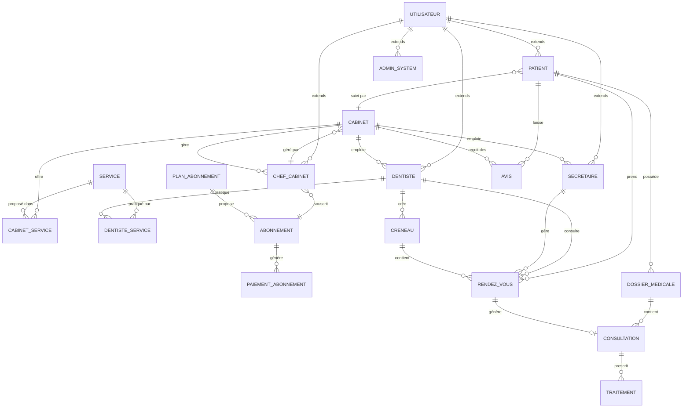
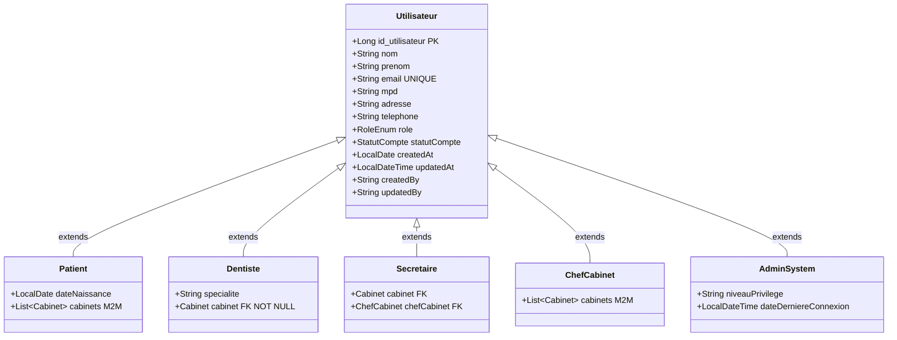
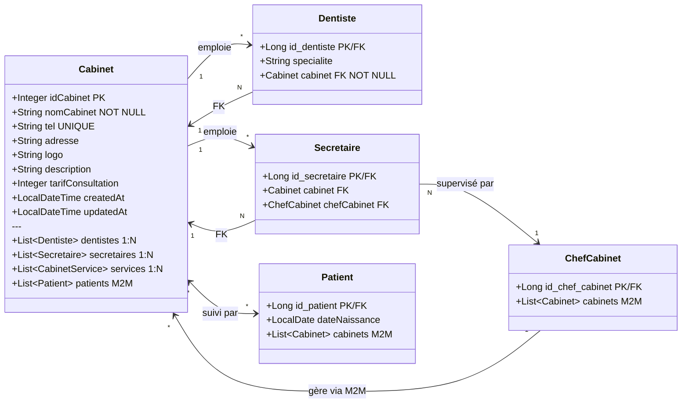
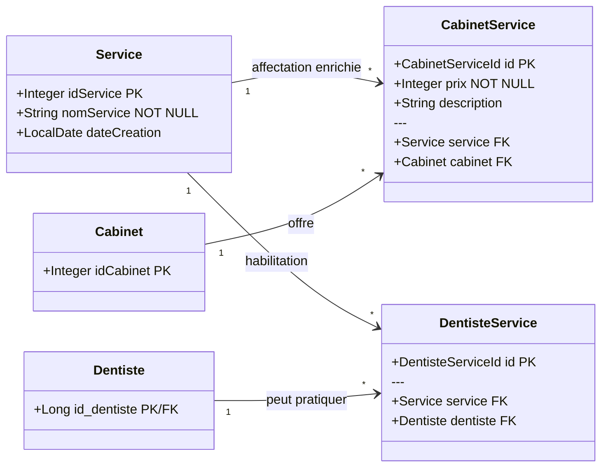
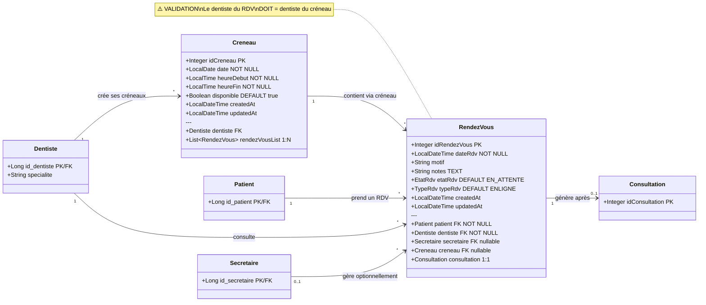
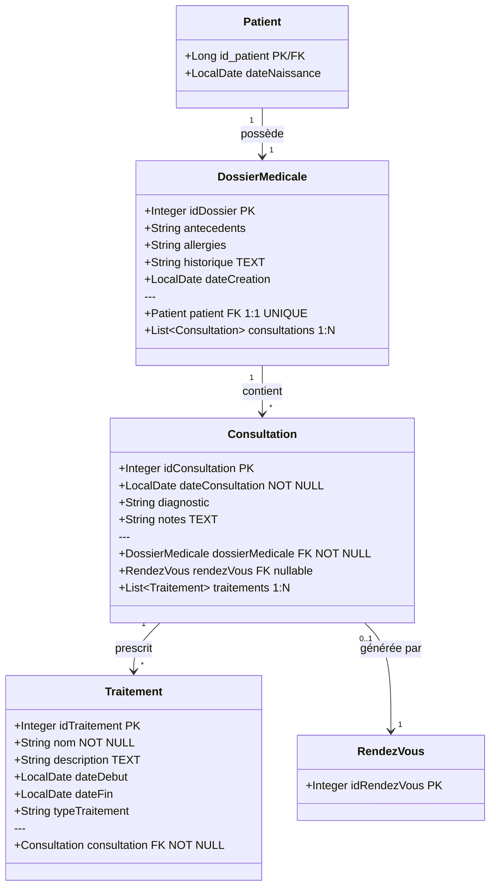
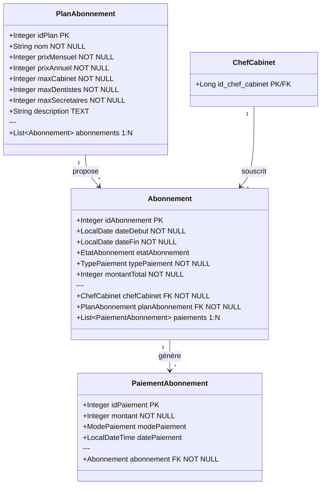
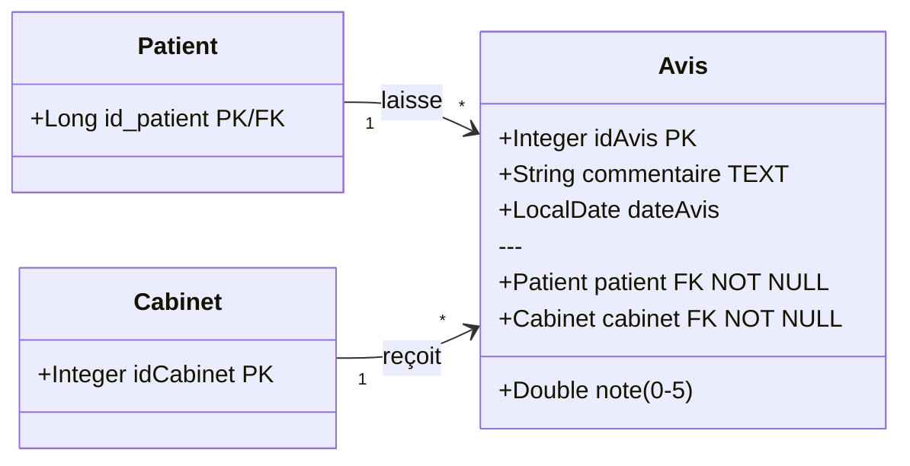

# 🗺️ Tooth Office API — Carte des Entités

> **Héritage :** Stratégie `JOINED` — chaque sous-classe a sa propre table liée à `Utilisateur` par une FK partagée (PK = FK).  
> **Package :** `org.odk.tooth_office.Entity`

---

## Table des matières

1. [Hiérarchie d'héritage (Utilisateur)](#1-hiérarchie-dhéritage--utilisateur)
2. [Cabinet & Personnel](#2-cabinet--personnel)
3. [Services](#3-services)
4. [Agenda & Rendez-vous](#4-agenda--rendez-vous)
5. [Médical](#5-médical)
6. [Abonnements & Paiements](#6-abonnements--paiements)
7. [Avis](#7-avis)
8. [Diagramme des relations (ERD textuel)](#8-diagramme-des-relations-erd)

---

## 1. Hiérarchie d'héritage — `Utilisateur`

### `Utilisateur` — table `Utilisateur`
> Classe mère abstraite. Stratégie `@Inheritance(JOINED)`.

| Champ            | Type            | Contraintes                   | Description                        |
|------------------|-----------------|-------------------------------|------------------------------------|
| `id_utilisateur` | `Long` 🔑 PK    | `@GeneratedValue(IDENTITY)`   | Clé primaire auto-incrémentée      |
| `nom`            | `String(50)`    | `NOT NULL`                    | Nom de famille                     |
| `prenom`         | `String(50)`    | `NOT NULL`                    | Prénom                             |
| `email`          | `String(100)`   | `UNIQUE`, `NOT NULL`          | Adresse email (identifiant unique) |
| `mpd`            | `String(100)`   | `NOT NULL`                    | Mot de passe (à hacher)            |
| `adresse`        | `String(255)`   | nullable                      | Adresse postale                    |
| `role`           | `RoleEnum`      | `@Enumerated(STRING)`         | Rôle système                       |
| `telephone`      | `String(20)`    | nullable                      | Numéro de téléphone                |
| `statutCompte`   | `StatutCompte`  | `@Enumerated(STRING)`         | Statut du compte                   |
| `createdAt`      | `LocalDate`     | nullable                      | Date de création                   |
| `updatedAt`      | `LocalDateTime` | nullable                      | Date de dernière modification      |
| `createdBy`      | `String(100)`   | nullable                      | Auteur de la création              |
| `updatedBy`      | `String(100)`   | nullable                      | Auteur de la dernière modification |

---

### `Patient` — table `Patient`
> Hérite de `Utilisateur`. PK/FK partagée : `id_patient`.

| Champ           | Type              | Contraintes             | Description                  |
|-----------------|-------------------|-------------------------|------------------------------|
| `id_patient`    | `Long` 🔑 PK/FK   | `@PrimaryKeyJoinColumn` | FK vers `Utilisateur`        |
| `dateNaissance` | `LocalDate`       | nullable                | Date de naissance du patient |

**Relations :**

| Relation   | Type          | Cible     | Table de jointure                               | Description                      |
|------------|---------------|-----------|-------------------------------------------------|----------------------------------|
| `cabinets` | `@ManyToMany` | `Cabinet` | `PATIENT_CABINET` (`id_patient`, `id_cabinet`) | Cabinets qui suivent ce patient  |

---

### `Dentiste` — table `Dentiste`
> Hérite de `Utilisateur`. PK/FK partagée : `id_dentiste`.

| Champ        | Type              | Contraintes             | Description           |
|--------------|-------------------|-------------------------|-----------------------|
| `id_dentiste`| `Long` 🔑 PK/FK   | `@PrimaryKeyJoinColumn` | FK vers `Utilisateur` |
| `specialite` | `String(100)`     | nullable                | Spécialité médicale   |

**Relations :**

| Relation  | Type         | Cible     | FK                       | Description                          |
|-----------|--------------|-----------|--------------------------|--------------------------------------|
| `cabinet` | `@ManyToOne` | `Cabinet` | `id_cabinet` `NOT NULL`  | Cabinet auquel appartient le dentiste |

---

### `ChefCabinet` — table `Chef_Cabinet`
> Hérite de `Utilisateur`. PK/FK partagée : `id_chef_cabinet`.

| Champ             | Type            | Contraintes             | Description           |
|-------------------|-----------------|-------------------------|-----------------------|
| `id_chef_cabinet` | `Long` 🔑 PK/FK | `@PrimaryKeyJoinColumn` | FK vers `Utilisateur` |

**Relations :**

| Relation   | Type          | Cible     | Table de jointure                                        | Description                    |
|------------|---------------|-----------|----------------------------------------------------------|--------------------------------|
| `cabinets` | `@ManyToMany` | `Cabinet` | `CHEFCABINET_CABINET` (`id_chef_cabinet`, `id_cabinet`) | Cabinets gérés par ce chef     |

---

### `Secretaire` — table `Secretaire`
> Hérite de `Utilisateur`. PK/FK partagée : `id_secretaire`.

| Champ           | Type            | Contraintes             | Description           |
|-----------------|-----------------|-------------------------|-----------------------|
| `id_secretaire` | `Long` 🔑 PK/FK | `@PrimaryKeyJoinColumn` | FK vers `Utilisateur` |

**Relations :**

| Relation      | Type         | Cible         | FK                 | Description                         |
|---------------|--------------|---------------|--------------------|-------------------------------------|
| `cabinet`     | `@ManyToOne` | `Cabinet`     | `id_cabinet`       | Cabinet où travaille la secrétaire  |
| `chefCabinet` | `@ManyToOne` | `ChefCabinet` | `id_chef_cabinet`  | Chef qui supervise cette secrétaire |

---

### `AdminSystem` — table `AdminSystem`
> Hérite de `Utilisateur`. PK/FK partagée : `id_admin`.

| Champ                   | Type            | Contraintes             | Description                         |
|-------------------------|-----------------|-------------------------|-------------------------------------|
| `id_admin`              | `Long` 🔑 PK/FK | `@PrimaryKeyJoinColumn` | FK vers `Utilisateur`               |
| `niveauPrivilege`       | `String(100)`   | nullable                | Niveau de privilège administrateur  |
| `dateDerniereConnexion` | `LocalDateTime` | nullable                | Horodatage de la dernière connexion |

---

## 2. Cabinet & Personnel

### `Cabinet` — table `Cabinet`

| Champ               | Type            | Contraintes                 | Description                       |
|---------------------|-----------------|-----------------------------|-----------------------------------|
| `idCabinet`         | `Integer` 🔑 PK | `@GeneratedValue(IDENTITY)` | Identifiant auto                  |
| `nomCabinet`        | `String(50)`    | `NOT NULL`                  | Nom du cabinet                    |
| `tel`               | `String(50)`    | `UNIQUE`                    | Téléphone (unique)                |
| `adresse`           | `String(60)`    | nullable                    | Adresse du cabinet                |
| `logo`              | `String(200)`   | nullable                    | Chemin/URL du logo                |
| `description`       | `String(200)`   | nullable                    | Description du cabinet            |
| `tarifConsultation` | `Integer`       | nullable                    | Tarif de base d'une consultation  |
| `createdAt`         | `LocalDateTime` | nullable                    | Date de création                  |
| `updatedAt`         | `LocalDateTime` | nullable                    | Date de dernière modification     |

**Relations (côté Cabinet) :**

| Relation      | Type          | Cible            | mappedBy / FK              | Cascade               | Description               |
|---------------|---------------|------------------|----------------------------|-----------------------|---------------------------|
| `dentistes`   | `@OneToMany`  | `Dentiste`       | `mappedBy="cabinet"`       | ALL                   | Dentistes du cabinet      |
| `secretaires` | `@OneToMany`  | `Secretaire`     | `mappedBy="cabinet"`       | ALL                   | Secrétaires du cabinet    |
| `services`    | `@OneToMany`  | `CabinetService` | `mappedBy="cabinet"`       | ALL + orphanRemoval   | Services offerts          |
| `patients`    | `@ManyToMany` | `Patient`        | `mappedBy="cabinets"`      | —                     | Patients suivis (inverse) |

---

## 3. Services

### `Service` — table `SERVICES`
> Catalogue global des types de soins proposés par la plateforme.

| Champ         | Type            | Contraintes                 | Description                         |
|---------------|-----------------|-----------------------------|-------------------------------------|
| `idService`   | `Integer` 🔑 PK | `@GeneratedValue(IDENTITY)` | Identifiant auto                    |
| `nomService`  | `String(50)`    | `NOT NULL`                  | Nom du soin (ex : détartrage)       |
| `dateCreation`| `LocalDate`     | nullable                    | Date de création dans le catalogue  |

---

### `CabinetService` — table `ASSIGNATION_CAB_SER`
> Table d'association enrichie : affectation d'un service à un cabinet avec prix spécifique.  
> **Clé composite :** `CabinetServiceId` (`id_service` + `id_cabinet`).

| Champ         | Type                    | Contraintes   | Description                      |
|---------------|-------------------------|---------------|----------------------------------|
| `id`          | `CabinetServiceId` 🔑 PK | `@EmbeddedId` | PK composite                     |
| `prix`        | `Integer`               | `NOT NULL`    | Prix du service dans ce cabinet  |
| `description` | `String(200)`           | nullable      | Description contextuelle         |

**Relations :**

| Relation  | Type         | Cible     | MapsId      | Description                   |
|-----------|--------------|-----------|-------------|-------------------------------|
| `service` | `@ManyToOne` | `Service` | `idService` | Service concerné              |
| `cabinet` | `@ManyToOne` | `Cabinet` | `idCabinet` | Cabinet proposant ce service  |

---

### `DentisteService` — table `SERVICE_DENTISTE`
> Table d'association : habilitation d'un dentiste à pratiquer un service.  
> **Clé composite :** `DentisteServiceId` (`id_service` + `id_dentiste`).

| Champ | Type                    | Contraintes   | Description  |
|-------|-------------------------|---------------|--------------|
| `id`  | `DentisteServiceId` 🔑 PK | `@EmbeddedId` | PK composite |

**Relations :**

| Relation   | Type         | Cible      | MapsId       | Description                             |
|------------|--------------|------------|--------------|-----------------------------------------|
| `service`  | `@ManyToOne` | `Service`  | `idService`  | Service que le dentiste peut pratiquer  |
| `dentiste` | `@ManyToOne` | `Dentiste` | `idDentiste` | Dentiste habilité                       |

---

## 4. Agenda & Rendez-vous

### `Creneau` — table `Creneau`
> Créneau horaire disponible d'un dentiste.

| Champ        | Type            | Contraintes                 | Description               |
|--------------|-----------------|-----------------------------|---------------------------|
| `idCreneau`  | `Integer` 🔑 PK | `@GeneratedValue(IDENTITY)` | Identifiant auto          |
| `date`       | `LocalDate`     | `NOT NULL`                  | Date du créneau           |
| `heureDebut` | `LocalTime`     | `NOT NULL`                  | Heure de début            |
| `heureFin`   | `LocalTime`     | `NOT NULL`                  | Heure de fin              |
| `disponible` | `Boolean`       | `NOT NULL`, défaut `true`   | Disponibilité du créneau  |
| `createdAt`  | `LocalDateTime` | nullable                    | Date de création          |
| `updatedAt`  | `LocalDateTime` | nullable                    | Date de modification      |

**Relations :**

| Relation          | Type         | Cible        | FK / mappedBy                       | Description                      |
|-------------------|--------------|--------------|-------------------------------------|----------------------------------|
| `dentiste`        | `@ManyToOne` | `Dentiste`   | `id_dentiste`                       | Dentiste propriétaire du créneau |
| `rendezVousList`  | `@OneToMany` | `RendezVous` | `mappedBy="creneau"` / CASCADE ALL  | RDV planifiés sur ce créneau     |

---

### `RendezVous` — table `Rendez_vous`
> Rendez-vous entre un patient et un dentiste sur un créneau donné.

| Champ          | Type            | Contraintes                          | Description                  |
|----------------|-----------------|--------------------------------------|------------------------------|
| `idRendezVous` | `Integer` 🔑 PK | `@GeneratedValue(IDENTITY)`          | Identifiant auto             |
| `dateRdv`      | `LocalDateTime` | `NOT NULL`                           | Date et heure du rendez-vous |
| `motif`        | `String(50)`    | nullable                             | Motif de consultation        |
| `notes`        | `TEXT`          | nullable                             | Notes libres                 |
| `etatRdv`      | `EtatRdv`       | `@Enumerated(STRING)`, défaut `EN_ATTENTE` | État du RDV           |
| `typeRdv`      | `TypeRdv`       | `@Enumerated(STRING)`, défaut `ENLIGNE`    | Type de RDV           |
| `createdAt`    | `LocalDateTime` | nullable                             | Date de création             |
| `updatedAt`    | `LocalDateTime` | nullable                             | Date de modification         |

**Relations :**

| Relation       | Type         | Cible          | FK / mappedBy                        | Description                                           |
|----------------|--------------|----------------|--------------------------------------|-------------------------------------------------------|
| `patient`      | `@ManyToOne` | `Patient`      | `id_patient` `NOT NULL`              | Patient concerné                                      |
| `dentiste`     | `@ManyToOne` | `Dentiste`     | `id_dentiste` `NOT NULL`             | Dentiste concerné *(doit correspondre au créneau)*    |
| `secretaire`   | `@ManyToOne` | `Secretaire`   | `id_secretaire`                      | Secrétaire ayant géré le RDV (optionnel)              |
| `creneau`      | `@ManyToOne` | `Creneau`      | `id_creneau`                         | Créneau réservé (optionnel)                           |
| `consultation` | `@OneToOne`  | `Consultation` | `mappedBy="rendezVous"` CASCADE ALL  | Consultation issue de ce RDV                          |

> ⚠️ **Règle métier :** le `dentiste` du RDV DOIT correspondre au `dentiste` du `Creneau`. À valider côté service.

---

## 5. Médical

### `DossierMedicale` — table `DossierMedicale`
> Dossier médical unique d'un patient.

| Champ         | Type            | Contraintes                 | Description                  |
|---------------|-----------------|-----------------------------|------------------------------|
| `idDossier`   | `Integer` 🔑 PK | `@GeneratedValue(IDENTITY)` | Identifiant auto             |
| `antecedents` | `String(100)`   | nullable                    | Antécédents médicaux         |
| `allergies`   | `String(100)`   | nullable                    | Allergies connues            |
| `historique`  | `TEXT`          | nullable                    | Historique global des soins  |
| `dateCreation`| `LocalDate`     | nullable                    | Date d'ouverture du dossier  |

**Relations :**

| Relation        | Type         | Cible          | FK / mappedBy                                         | Description                            |
|-----------------|--------------|----------------|-------------------------------------------------------|----------------------------------------|
| `patient`       | `@OneToOne`  | `Patient`      | `id_patient` `NOT NULL`, `UNIQUE`                     | Patient propriétaire (1-1)             |
| `consultations` | `@OneToMany` | `Consultation` | `mappedBy="dossierMedicale"` CASCADE ALL + orphanRemoval | Historique des consultations        |

---

### `Consultation` — table `Consultation`
> Consultation médicale réalisée par un dentiste, rattachée à un dossier.

| Champ              | Type        | Contraintes                 | Description             |
|--------------------|-------------|-----------------------------|-------------------------|
| `idConsultation`   | `Integer` 🔑 PK | `@GeneratedValue(IDENTITY)` | Identifiant auto    |
| `dateConsultation` | `LocalDate` | `NOT NULL`                  | Date de la consultation |
| `diagnostic`       | `String(50)`| nullable                    | Diagnostic posé         |
| `notes`            | `TEXT`      | nullable                    | Notes cliniques         |

**Relations :**

| Relation          | Type         | Cible            | FK / mappedBy                               | Description                               |
|-------------------|--------------|------------------|---------------------------------------------|-------------------------------------------|
| `dossierMedicale` | `@ManyToOne` | `DossierMedicale`| `id_dossier` `NOT NULL`                     | Dossier auquel appartient la consultation |
| `rendezVous`      | `@OneToOne`  | `RendezVous`     | `id_rendez_vous` (optionnel)                | RDV à l'origine de cette consultation     |
| `traitements`     | `@OneToMany` | `Traitement`     | `mappedBy="consultation"` CASCADE ALL + orphanRemoval | Traitements prescrits           |

---

### `Traitement` — table `Traitement`
> Traitement prescrit lors d'une consultation.

| Champ            | Type            | Contraintes                 | Description                  |
|------------------|-----------------|-----------------------------|------------------------------|
| `idTraitement`   | `Integer` 🔑 PK | `@GeneratedValue(IDENTITY)` | Identifiant auto             |
| `nom`            | `String(50)`    | `NOT NULL`                  | Nom du traitement            |
| `description`    | `TEXT`          | nullable                    | Description détaillée        |
| `dateDebut`      | `LocalDate`     | nullable                    | Date de début du traitement  |
| `dateFin`        | `LocalDate`     | nullable                    | Date de fin prévue           |
| `typeTraitement` | `String(50)`    | nullable                    | Catégorie du traitement      |

**Relations :**

| Relation       | Type         | Cible          | FK                            | Description                                  |
|----------------|--------------|----------------|-------------------------------|----------------------------------------------|
| `consultation` | `@ManyToOne` | `Consultation` | `id_consultation` `NOT NULL`  | Consultation ayant prescrit ce traitement    |

---

## 6. Abonnements & Paiements

### `PlanAbonnement` — table `Plan_Abonnement`
> Offre d'abonnement de la plateforme (limites, tarifs).

| Champ            | Type            | Contraintes                 | Description                         |
|------------------|-----------------|-----------------------------|-------------------------------------|
| `idPlan`         | `Integer` 🔑 PK | `@GeneratedValue(IDENTITY)` | Identifiant auto                    |
| `nom`            | `String(50)`    | `NOT NULL`                  | Nom du plan                         |
| `prixMensuel`    | `Integer`       | `NOT NULL`                  | Prix mensuel (FCFA)                 |
| `prixAnnuel`     | `Integer`       | `NOT NULL`                  | Prix annuel (FCFA)                  |
| `maxCabinet`     | `Integer`       | `NOT NULL`                  | Nb max de cabinets autorisés        |
| `maxDentistes`   | `Integer`       | `NOT NULL`                  | Nb max de dentistes autorisés       |
| `maxSecretaires` | `Integer`       | `NOT NULL`                  | Nb max de secrétaires autorisées    |
| `description`    | `TEXT`          | nullable                    | Description du plan                 |

**Relations :**

| Relation      | Type         | Cible        | mappedBy                                    | Description            |
|---------------|--------------|--------------|---------------------------------------------|------------------------|
| `abonnements` | `@OneToMany` | `Abonnement` | `mappedBy="planAbonnement"` CASCADE ALL + orphanRemoval | Abonnements souscrits |

---

### `Abonnement` — table `Abonnement`
> Abonnement d'un chef de cabinet à un plan.

| Champ             | Type             | Contraintes                 | Description                          |
|-------------------|------------------|-----------------------------|--------------------------------------|
| `idAbonnement`    | `Integer` 🔑 PK  | `@GeneratedValue(IDENTITY)` | Identifiant auto                     |
| `dateDebut`       | `LocalDate`      | `NOT NULL`                  | Date de début de l'abonnement        |
| `dateFin`         | `LocalDate`      | `NOT NULL`                  | Date de fin de l'abonnement          |
| `etatAbonnement`  | `EtatAbonnement` | `@Enumerated(STRING)`       | État courant (actif, expiré…)        |
| `typePaiement`    | `TypePaiement`   | `NOT NULL`, `@Enumerated(STRING)` | Mensuel ou annuel              |
| `montantTotal`    | `Integer`        | `NOT NULL`                  | Montant total de l'abonnement        |

**Relations :**

| Relation         | Type         | Cible               | FK / mappedBy                            | Description                 |
|------------------|--------------|---------------------|------------------------------------------|-----------------------------|
| `chefCabinet`    | `@ManyToOne` | `ChefCabinet`       | `id_chef_cabinet` `NOT NULL`             | Chef souscripteur           |
| `planAbonnement` | `@ManyToOne` | `PlanAbonnement`    | `id_plan` `NOT NULL`                     | Plan souscrit               |
| `paiements`      | `@OneToMany` | `PaiementAbonnement`| `mappedBy="abonnement"` CASCADE ALL + orphanRemoval | Échéances payées |

---

### `PaiementAbonnement` — table `Paiement_Abonnement`
> Paiement (versement) effectué pour un abonnement.

| Champ          | Type            | Contraintes                 | Description             |
|----------------|-----------------|-----------------------------|-------------------------|
| `idPaiement`   | `Integer` 🔑 PK | `@GeneratedValue(IDENTITY)` | Identifiant auto        |
| `montant`      | `Integer`       | `NOT NULL`                  | Montant versé           |
| `modePaiement` | `ModePaiement`  | `@Enumerated(STRING)`       | Moyen de paiement       |
| `datePaiement` | `LocalDateTime` | nullable                    | Horodatage du paiement  |

**Relations :**

| Relation     | Type         | Cible        | FK                          | Description                                   |
|--------------|--------------|--------------|-----------------------------|-----------------------------------------------|
| `abonnement` | `@ManyToOne` | `Abonnement` | `id_abonnement` `NOT NULL`  | Abonnement auquel se rattache ce paiement     |

---

## 7. Avis

### `Avis` — table `Avis`
> Avis d'un patient sur un cabinet (note + commentaire).

| Champ        | Type            | Contraintes                 | Description            |
|--------------|-----------------|-----------------------------|------------------------|
| `idAvis`     | `Integer` 🔑 PK | `@GeneratedValue(IDENTITY)` | Identifiant auto       |
| `commentaire`| `TEXT`          | nullable                    | Texte de l'avis        |
| `note`       | `Double`        | nullable                    | Note de 0 à 5          |
| `dateAvis`   | `LocalDate`     | nullable                    | Date de publication    |

**Relations :**

| Relation  | Type         | Cible     | FK                       | Description     |
|-----------|--------------|-----------|--------------------------|-----------------|
| `patient` | `@ManyToOne` | `Patient` | `id_patient` `NOT NULL`  | Patient auteur  |
| `cabinet` | `@ManyToOne` | `Cabinet` | `id_cabinet` `NOT NULL`  | Cabinet évalué  |

---

## 8. Diagramme des relations (ERD) — Vue Complète et Détaillée

Ce diagramme représente **toutes les relations** entre les 15 entités du système. Chaque relation est annotée avec sa cardinalité (1:1, 1:N, N:M) et le type JPA utilisé.

> 💡 **Astuce** : Tous les diagrammes ci-dessous ont une version plein écran disponible dans le dossier `diagrams/`. Cliquez sur les liens 👁️ ci-dessous pour voir en plein écran.

---

### 📊 Vue Globale — Diagramme Relationnel Complet

**[👁️ Voir en plein écran](diagrams/00-global-overview.md)** | [🔗 Navigation](diagrams/README.md)

---

### 1️⃣ Hiérarchie des Utilisateurs (Stratégie JOINED)

**[👁️ Voir en plein écran](diagrams/01-utilisateur-hierarchy.md)** | [🔗 Navigation](diagrams/README.md)

**Concept** : Héritage JPA `JOINED` — Une table `Utilisateur` + 5 tables filles. Chaque sous-classe hérite des colonnes parentes et ajoute les siennes.

---

### 2️⃣ Cabinet & Personnel — Organisation Hiérarchique

**[👁️ Voir en plein écran](diagrams/02-cabinet-personnel.md)** | [🔗 Navigation](diagrams/README.md)

**Logique métier** :
- Un **Cabinet** est le nœud central, liant dentistes, secrétaires et patients.
- Un **ChefCabinet** peut gérer plusieurs cabinets (relation M2M).
- Un **Dentiste** appartient à exactement 1 cabinet (FK `NOT NULL`).
- Une **Secrétaire** appartient à 1 cabinet et est supervisée par 1 chef.
- Un **Patient** peut être suivi par plusieurs cabinets (relation M2M).

---

### 3️⃣ Services — Catalogue & Affectations Enrichies

**[👁️ Voir en plein écran](diagrams/03-services.md)** | [🔗 Navigation](diagrams/README.md)

**Concept** : Les relations M2M vers les services ne sont **pas triviales** :
- **`CabinetService`** (table `ASSIGNATION_CAB_SER`) : Enrichie avec `prix` et `description`. Un service peut avoir **des tarifs différents** d'un cabinet à l'autre.
- **`DentisteService`** (table `SERVICE_DENTISTE`) : Détermine **quels dentistes sont qualifiés** pour pratiquer quels services.

---

### 4️⃣ Agenda & Rendez-vous — Le Cœur du Planning

**[👁️ Voir en plein écran](diagrams/04-agenda-rdv.md)** | [🔗 Navigation](diagrams/README.md)

**Règles métier** :
- Un **Créneau** est défini par 1 dentiste, une date, et une plage horaire.
- Un **RendezVous** réserve 1 créneau et lie patient + dentiste + (optionnellement) secrétaire.
- ⚠️ **Contrainte critique** : Le `dentiste` du RDV DOIT correspondre au `dentiste` du `Creneau`. À valider au niveau du service.
- Un RDV peut générer une **Consultation** après le soin.

---

### 5️⃣ Dossier Médical & Soins Cliniques — Parcours Patient

**[👁️ Voir en plein écran](diagrams/05-medical.md)** | [🔗 Navigation](diagrams/README.md)

**Logique métier** :
- Chaque **Patient** a exactement 1 **DossierMedicale** (1:1 UNIQUE).
- Un dossier contient l'**historique médical complet** : antécédents, allergies, parcours de soin.
- Chaque **Consultation** crée une entrée datée dans le dossier.
- Les **Traitements** sont des ordonnances prescrites lors de consultations.

---

### 6️⃣ Abonnements & Monétisation — Le SaaS

**[👁️ Voir en plein écran](diagrams/06-abonnements.md)** | [🔗 Navigation](diagrams/README.md)

**Concepts clés** :
- **PlanAbonnement** définit les limites (nombre de cabinets, dentistes, secrétaires autorisés).
- **Abonnement** est la souscription active d'un ChefCabinet à un plan donné.
- **PaiementAbonnement** enregistre chaque versement (montant, date, mode de paiement).
- États : `ACTIF`, `SUSPENDU`, `EXPIRE`.
- Modes : `CASH`, `CARTE_BANCAIRE`, `MOBILE_MONEY`.

---

### 7️⃣ Avis Patients — Retours & Réputation

**[👁️ Voir en plein écran](diagrams/07-avis.md)** | [🔗 Navigation](diagrams/README.md)

**Logique** : Chaque patient peut laisser un avis (note + commentaire) sur chaque cabinet qu'il fréquente.

---

### 📋 Résumé des Cardinalités

| Relation                        | Type   | Cardinalité | Table de Jointure          | Description                          |
|---------------------------------|--------|-------------|---------------------------|--------------------------------------|
| Patient ↔ Cabinet               | M2M    | N:N         | `PATIENT_CABINET`          | Patients suivis par cabinets         |
| ChefCabinet ↔ Cabinet           | M2M    | N:N         | `CHEFCABINET_CABINET`      | Cabinets gérés par chefs             |
| Cabinet → Dentiste              | 1:N    | 1:∞         | FK `Dentiste.id_cabinet`   | Dentistes d'un cabinet              |
| Cabinet → Secretaire            | 1:N    | 1:∞         | FK `Secretaire.id_cabinet` | Secrétaires d'un cabinet            |
| Service ↔ Cabinet (via association) | M2M | N:N        | `ASSIGNATION_CAB_SER`      | Services offerts, tarifs spécifiques |
| Service ↔ Dentiste (via association)| M2M | N:N        | `SERVICE_DENTISTE`         | Dentistes qualifiés pour un service  |
| Dentiste → Créneau              | 1:N    | 1:∞         | FK `Creneau.id_dentiste`   | Créneaux d'un dentiste              |
| Créneau ↔ RendezVous            | 1:N    | 1:∞         | FK `RendezVous.id_creneau` | RDV sur un créneau                   |
| Patient ↔ RendezVous            | 1:N    | 1:∞         | FK `RendezVous.id_patient` | RDV pris par un patient              |
| Dentiste ↔ RendezVous           | 1:N    | 1:∞         | FK `RendezVous.id_dentiste`| RDV consulté par un dentiste         |
| Secretaire → RendezVous         | 1:N    | 1:∞         | FK `RendezVous.id_secretaire` (nullable) | RDV gérés          |
| RendezVous → Consultation       | 1:1    | 1:1         | FK `Consultation.id_rendez_vous` | RDV → Consultation  |
| Patient → DossierMedicale       | 1:1    | 1:1 (UNIQUE) | FK `DossierMedicale.id_patient` | Dossier médical du patient |
| DossierMedicale → Consultation  | 1:N    | 1:∞         | FK `Consultation.id_dossier` | Consultations du dossier             |
| Consultation → Traitement       | 1:N    | 1:∞         | FK `Traitement.id_consultation` | Traitements prescrits      |
| ChefCabinet → Abonnement        | 1:N    | 1:∞         | FK `Abonnement.id_chef_cabinet` | Abonnements du chef       |
| PlanAbonnement → Abonnement     | 1:N    | 1:∞         | FK `Abonnement.id_plan` | Abonnements à ce plan               |
| Abonnement → PaiementAbonnement | 1:N    | 1:∞         | FK `PaiementAbonnement.id_abonnement` | Paiements de l'abonnement |
| Patient → Avis                  | 1:N    | 1:∞         | FK `Avis.id_patient`       | Avis laissés par un patient          |
| Cabinet → Avis                  | 1:N    | 1:∞         | FK `Avis.id_cabinet`       | Avis reçus par un cabinet            |

---

## Récapitulatif des tables de jointure

| Table de jointure      | Entité JPA        | Type            | Colonnes clés                                              |
|------------------------|-------------------|-----------------|------------------------------------------------------------|
| `PATIENT_CABINET`      | *(pure M2M)*      | `@JoinTable`    | `id_patient`, `id_cabinet`                                 |
| `CHEFCABINET_CABINET`  | *(pure M2M)*      | `@JoinTable`    | `id_chef_cabinet`, `id_cabinet`                            |
| `ASSIGNATION_CAB_SER`  | `CabinetService`  | Entité enrichie | `id_service`, `id_cabinet` + champs `prix`, `description`  |
| `SERVICE_DENTISTE`     | `DentisteService` | Entité enrichie | `id_service`, `id_dentiste`                                |

---

## Récapitulatif des Enums utilisés

| Enum             | Entité utilisant      | Description                          |
|------------------|-----------------------|--------------------------------------|
| `RoleEnum`       | `Utilisateur`         | Rôle système de l'utilisateur        |
| `StatutCompte`   | `Utilisateur`         | État du compte utilisateur           |
| `EtatRdv`        | `RendezVous`          | État du rendez-vous (défaut : `EN_ATTENTE`) |
| `TypeRdv`        | `RendezVous`          | Canal du RDV (défaut : `ENLIGNE`)    |
| `EtatAbonnement` | `Abonnement`          | État de l'abonnement                 |
| `TypePaiement`   | `Abonnement`          | Périodicité de paiement              |
| `ModePaiement`   | `PaiementAbonnement`  | Moyen de paiement utilisé            |
