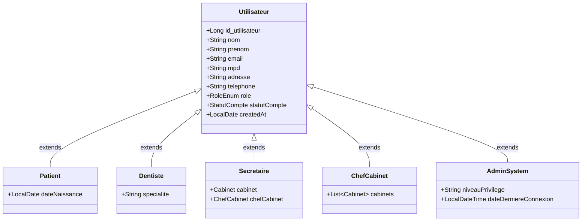
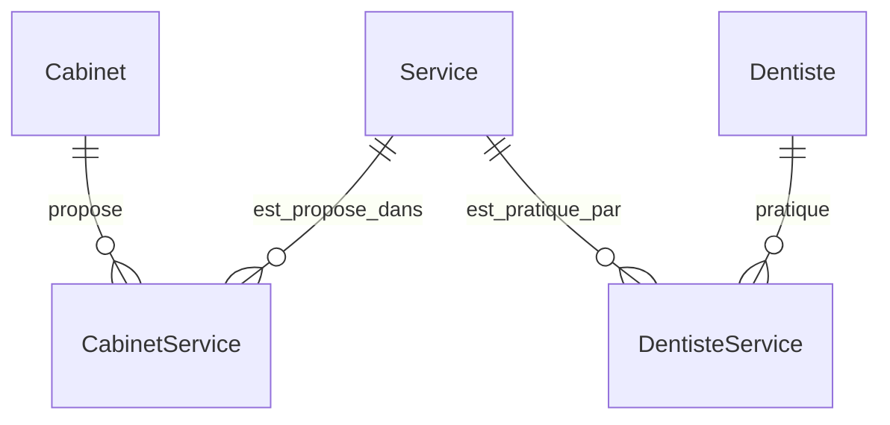
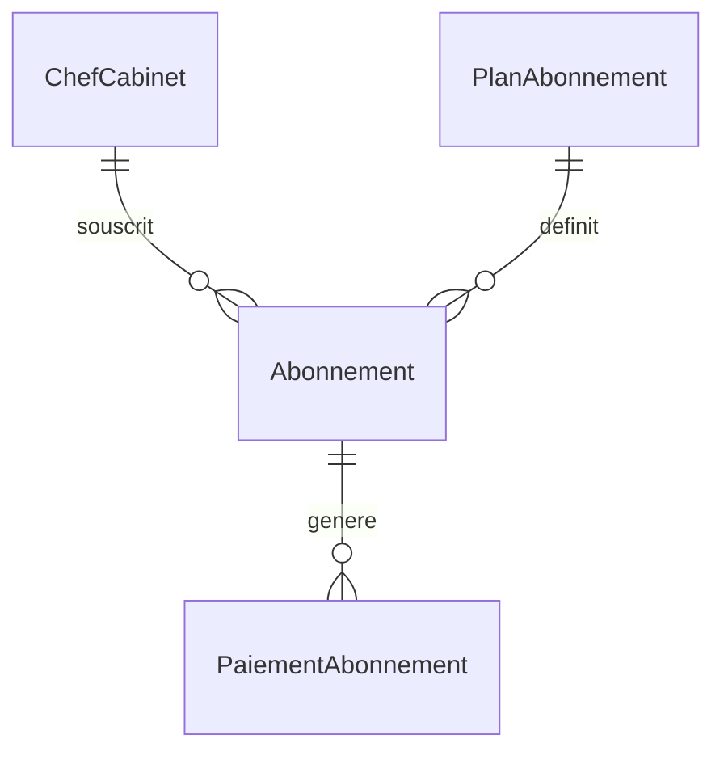
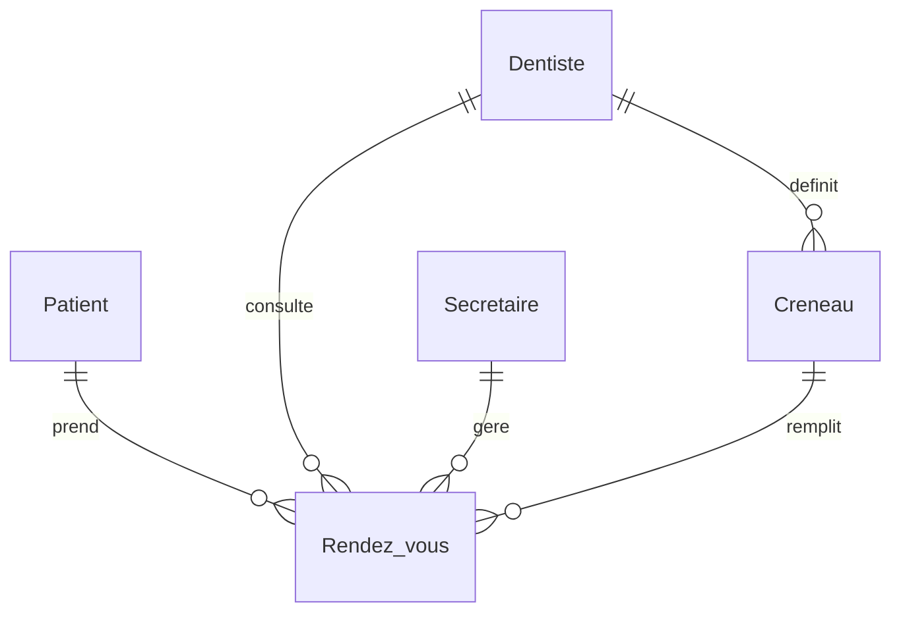
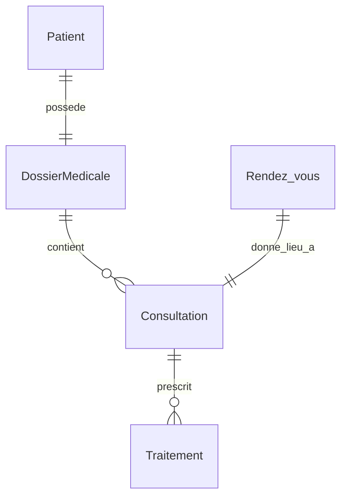

# 📘 Guide Explicatif des Entités & de la Logique Métier — Tooth Office API

Ce document est conçu pour aider les développeurs débutants à comprendre la structure de la base de données, la logique métier et les relations entre les différentes classes Java (appelées **Entités JPA**) dans l'application de gestion de cabinets dentaires **Tooth Office**.

---

## 💡 Qu'est-ce qu'une Entité JPA ?

Dans un projet Spring Boot avec Spring Data JPA (Java Persistence API), une **Entité** est une classe Java simple (un POJO) qui correspond à une table dans la base de données.
* Chaque **attribut** (variable de la classe) représente une colonne de la table.
* Chaque **instance** de la classe (un objet créé avec `new`) correspond à une ligne de cette table.
* Les **annotations** (comme `@Entity`, `@Table`, `@Id`, etc.) sont des instructions qui indiquent à Spring Boot et à Hibernate comment stocker, lier et manipuler ces données dans la base.

---

## 📂 Organisation des Entités par Composants

Pour faciliter la compréhension, nous avons regroupé nos 21 entités en 6 grands modules fonctionnels :
1. **La Hiérarchie des Utilisateurs** (Utilisateurs et rôles associés)
2. **Le Cabinet Dentaire & l'Offre de Prestations** (Les structures et les services)
3. **Le Système d'Abonnement du Cabinet** (La facturation de l'application SaaS)
4. **La Planification et les Rendez-vous** (Les créneaux et les réservations)
5. **Le Dossier Médical et les Soins Cliniques** (Consultations et ordonnances/traitements)
6. **Le Retour d'Expérience** (Les avis des patients)

---

## 1. La Hiérarchie des Utilisateurs (Héritage `JOINED`)

Pour représenter les différents rôles dans l'application, nous utilisons une stratégie d'héritage JPA appelée **`JOINED`**. 
Dans la base de données, cela se traduit par :
* Une table parent `Utilisateur` contenant les informations communes (nom, prénom, email, téléphone, mot de passe).
* Des tables enfants séparées (`Patient`, `Dentiste`, `Secretaire`, `Chef_Cabinet`, `AdminSystem`) qui contiennent uniquement les attributs spécifiques à chaque rôle et sont liées à la table parent par leur clé primaire (qui sert aussi de clé étrangère).

### `Utilisateur.java`
* **Rôle** : Classe de base pour toutes les personnes physiques se connectant à la plateforme.
* **Concepts clés** :
  * `@Inheritance(strategy = InheritanceType.JOINED)` : Indique à Hibernate de créer une table pour la classe mère et une table par classe fille.
  * `StatutCompte` (`VALIDE`, `SUSPENDU`, `SUPPRIMER`) : Permet de gérer l'activation ou le blocage temporaire d'un compte.
  * `RoleEnum` (`PATIENT`, `DENTISTE`, `SECRETAIRE`, `CHEF_CABINET`) : Rôle applicatif pour la sécurité et les accès.

### `Patient.java`
* **Rôle** : Personne qui prend rendez-vous, consulte ses prescriptions et laisse des avis.
* **Attribut spécifique** : `dateNaissance` (pour calculer l'âge ou valider les dossiers pédiatriques).
* **Annotation clé** : `@PrimaryKeyJoinColumn(name = "id_patient")` indique que la clé primaire de la table `Patient` s'appelle `id_patient` et fait référence à `id_utilisateur` de la table parent.

### `Dentiste.java`
* **Rôle** : Professionnel médical qui propose des créneaux, réalise des consultations et rédige des ordonnances/traitements.
* **Attribut spécifique** : `specialite` (ex: Orthodontiste, Parodontiste, Chirurgien-Dentiste).

### `Secretaire.java`
* **Rôle** : Assistant(e) du cabinet dentaire chargé(e) de valider/annuler les rendez-vous et de configurer l'agenda.
* **Relations** :
  * `@ManyToOne` vers `Cabinet` : Rattaché(e) à un cabinet dentaire unique.
  * `@ManyToOne` vers `ChefCabinet` : Sous la responsabilité d'un chef de cabinet spécifique.

### `ChefCabinet.java`
* **Rôle** : Propriétaire ou gérant d'un ou plusieurs cabinets dentaires. C'est lui qui paie l'abonnement à l'application.
* **Relations** :
  * `@ManyToMany` vers `Cabinet` via la table de jointure `CHEFCABINET_CABINET` : Il peut gérer plusieurs cabinets et un cabinet peut posséder plusieurs gérants associés.

### `AdminSystem.java`
* **Rôle** : Administrateur général de la plateforme SaaS. Il gère les inscriptions des cabinets, gère les abonnements et résout les problèmes système.
* **Attributs spécifiques** : `niveauPrivilege` et `dateDerniereConnexion`.

---

## 2. Le Cabinet Dentaire & l'Offre de Prestations

Ce module structure les entités représentant l'infrastructure physique (les cabinets) et les soins médicaux de base proposés (les services).

### `Cabinet.java`
* **Rôle** : Représente une clinique dentaire physique hébergeant des dentistes, des secrétaires et recevant des patients.
* **Attributs clés** : `nomCabinet`, `tel`, `adresse`, `logo`, `description` et `tarifConsultation` (le tarif par défaut d'une simple visite).

### `Service.java`
* **Rôle** : Prestation de soin dentaire standard enregistrée globalement sur la plateforme (ex : "Détartrage", "Extraction de dent", "Implants").

### 🤝 Tables d'association Many-to-Many personnalisées
Pour lier les cabinets, les dentistes et les services, nous n'utilisons pas une simple relation `@ManyToMany` automatique d'Hibernate. Nous avons créé des entités de jointure spécifiques afin de stocker des attributs additionnels (comme le tarif spécifique ou le niveau d'autorisation).

#### `CabinetService.java` & `CabinetServiceId.java`
* **Pourquoi ?** Un service générique (ex : "Blanchiment") peut avoir des tarifs différents d'un cabinet à un autre. Cette entité représente l'offre d'un service **dans un cabinet particulier** à un **prix** spécifique avec sa propre **description**.
* **Clé composite** : `@EmbeddedId` utilise la classe `CabinetServiceId` composée des identifiants `idService` et `idCabinet` pour garantir qu'un cabinet ne propose pas deux fois le même service de manière doublonnée.

#### `DentisteService.java` & `DentisteServiceId.java`
* **Pourquoi ?** Tous les dentistes d'un cabinet ne savent pas forcément faire tous les soins (ex : poser des implants complexes). Cette table associe un `Dentiste` aux `Services` qu'il est qualifié pour pratiquer.
* **Clé composite** : `@EmbeddedId` utilise `DentisteServiceId` composée de `idService` et `idDentiste`.

---

## 3. Le Système d'Abonnement du Cabinet (Monétisation SaaS)

L'application Tooth Office fonctionne sous forme de logiciel payant par abonnement (SaaS). Ce module gère les forfaits financiers souscrits par les cabinets.

### `PlanAbonnement.java`
* **Rôle** : Catalogue des forfaits proposés (ex : Plan "Basique", "Premium", "Entreprise").
* **Logique métier** : Il définit les limites structurelles imposées au cabinet géré par le Chef de Cabinet :
  * `prixMensuel` / `prixAnnuel` : Les coûts du forfait.
  * `maxCabinet` : Combien de cliniques physiques il peut enregistrer.
  * `maxDentistes` : Le nombre maximum de praticiens autorisés dans le système.
  * `maxSecretaires` : Le nombre de secrétaires autorisées.

### `Abonnement.java`
* **Rôle** : Représente la souscription active ou passée d'un `ChefCabinet` à un `PlanAbonnement` spécifique.
* **Logique métier** : Contient la date de début, la date de fin (période de validité), le montant total facturé, et son état actuel (`EtatAbonnement` : `ACTIF`, `SUSPENDU` ou `EXPIRE`).

### `PaiementAbonnement.java`
* **Rôle** : Enregistre l'historique de chaque facture ou transaction financière liée à un abonnement.
* **Attributs clés** : `montant`, `modePaiement` (`CASH`, `CARTE_BANCAIRE`, `MOBILE_MONEY`), `datePaiement`.

---

## 4. La Planification et les Rendez-vous

Ce module gère le temps des praticiens et l'accès des patients aux soins cliniques.

### `Creneau.java`
* **Rôle** : Un créneau horaire de travail déclaré par un dentiste (ex : le 19 Juin 2026 de 09h00 à 09h30).
* **Logique métier** : Un créneau appartient à un `Dentiste` unique et possède un booléen `disponible`. Dès qu'un patient réserve un rendez-vous sur ce créneau, `disponible` passe à `false`.

### `RendezVous.java`
* **Rôle** : L'acte de réservation formalisé. Il rassemble 4 entités :
  1. Le `Patient` qui demande le soin.
  2. Le `Dentiste` qui va soigner.
  3. Le `Creneau` réservé.
  4. La `Secretaire` (optionnelle, si la réservation a été faite par téléphone/sur place).
* **Attributs métiers** :
  * `etatRdv` : `EN_ATTENTE` (par défaut), `VALIDE` par la secrétaire, `FAIT` après la visite, `ANNULE`, ou `REPORTE`.
  * `typeRdv` : `ENLIGNE` (téléconsultation) ou `SURPLACE` (présentiel).

---

## 5. Le Dossier Médical et les Soins Cliniques

Une fois le rendez-vous honoré, le dentiste accède et alimente le parcours de soin clinique du patient.

### `DossierMedicale.java`
* **Rôle** : Le carnet de santé dentaire unique du patient.
* **Relations** : Relation `@OneToOne` stricte avec le `Patient`.
* **Attributs médicaux** : Contient les `antecedents` médicaux, les `allergies` connues du patient et un `historique` textuel global.

### `Consultation.java`
* **Rôle** : Représente la visite médicale effective chez le dentiste.
* **Relations** :
  * Liée à un `DossierMedicale` (pour archiver la consultation).
  * Liée par une relation `@OneToOne` à un `RendezVous` (le rendez-vous qui a mené à cette consultation).
* **Attributs cliniques** : `dateConsultation`, `diagnostic` (ex: "Carie sur la molaire 36") et `notes` du dentiste.

### `Traitement.java`
* **Rôle** : Les prescriptions et soins à suivre sur une période donnée (ex : prise d'antibiotiques, port d'une gouttière orthodontique).
* **Attributs clés** : `nom`, `description`, `dateDebut`, `dateFin` et `typeTraitement`.
* **Relation** : Rattaché à une `Consultation` de départ via une relation `@ManyToOne`.

---

## 6. Le Retour d'Expérience (Les Avis)

### `Avis.java`
* **Rôle** : Permet aux patients de noter et commenter la qualité de l'accueil et des soins d'un cabinet dentaire.
* **Attributs clés** : `commentaire`, `note` (nombre décimal compris entre 0.0 et 5.0) et `dateAvis`.
* **Relations** : Lié à un `Patient` (l'auteur de l'avis) et à un `Cabinet` (la structure évaluée).

---

## 📅 Les Énumérations (Enums)

Dans le dossier `Enum`, nous trouvons des types de données figés et sécurisés. Les enums évitent les erreurs de frappe (par exemple, écrire "Annulé" avec ou sans accents dans la base de données).

1. **`EtatRdv`** : `EN_ATTENTE`, `VALIDE`, `FAIT`, `ANNULE`, `REPORTE`
2. **`TypeRdv`** : `ENLIGNE`, `SURPLACE`
3. **`EtatAbonnement`** : `ACTIF`, `SUSPENDU`, `EXPIRE`
4. **`TypePaiement`** : `MENSUEL`, `ANNUEL` (rythme de facturation)
5. **`ModePaiement`** : `CASH`, `CARTE_BANCAIRE`, `MOBILE_MONEY`
6. **`RoleEnum`** : `CHEF_CABINET`, `PATIENT`, `SECRETAIRE`, `DENTISTE`
7. **`StatutCompte`** : `VALIDE` (actif), `SUSPENDU`, `SUPPRIMER`

---

## 🎓 Glossaire des Annotations JPA à destination des Débutants

Pour mieux comprendre le code Java présent dans les fichiers :

* **`@Entity`** : Déclare que cette classe Java est une entité persistante qui aura sa table correspondante en base de données.
* **`@Table(name = "...")`** : Permet de choisir explicitement le nom de la table SQL associée (par défaut, Hibernate prend le nom de la classe).
* **`@Id`** : Marque le champ situé juste en dessous comme étant la **Clé Primaire (Primary Key)** de la table.
* **`@GeneratedValue(strategy = GenerationType.IDENTITY)`** : Indique que la base de données doit incrémenter automatiquement cet identifiant à chaque ajout d'une ligne (ex: 1, 2, 3...).
* **`@Column(nullable = false, length = 50)`** : Ajoute des règles de validation sur la colonne SQL (ne peut pas être vide, taille maximum de 50 caractères).
* **`@Enumerated(EnumType.STRING)`** : Indique à Hibernate de stocker la valeur textuelle d'un Enum (ex: "ACTIF") plutôt que son index numérique (ex: 0) en base de données, ce qui facilite grandement la lecture de la base SQL.
* **`@ManyToOne` / `@OneToMany`** : Définit une relation entre deux tables. Par exemple, plusieurs consultations (`Many`) appartiennent à un seul dossier médical (`One`).
* **`@OneToOne`** : Définit une relation exclusive. Un dossier médical appartient à un seul patient et réciproquement.
* **`@ManyToMany`** : Définit une relation plusieurs-à-plusieurs. Par exemple, un chef de cabinet gère plusieurs cabinets dentaires, et un cabinet peut avoir plusieurs gérants.
* **`@EmbeddedId`** : Utilisé pour intégrer une clé primaire composite (composée de plusieurs colonnes).
* **`@MapsId`** : Permet de réutiliser une clé composite pour faire référence aux entités parentes associées dans une table de jointure.
